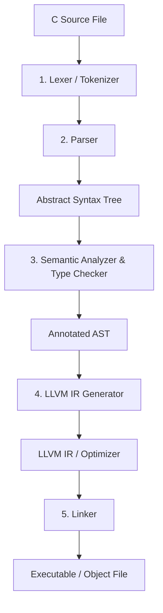

# `stricc`: Safe C Compiler Plan

This document outlines the design, architecture, and implementation plan for `stricc`, a safe compiler for a subset of the C programming language. `stricc` is written in Rust, utilizes LLVM for code generation, and is designed to completely eliminate **Undefined Behavior (UB)** either at compile time or via safe, defined runtime aborts/wrapping.

---

## 1. Vision & Core Objectives

1. **Safety First**: Zero Undefined Behavior. Any program compiled with `stricc` must have 100% deterministic, defined behavior. If safety cannot be proven statically, checks are inserted at runtime to abort execution safely (or perform defined operations like two's complement wrapping).
2. **Modern C Support**: Support a subset of modern C (aligning with C23 features such as `const`, `nullptr`, `auto`, and `constexpr`).
3. **GCC Command-Line Interface Compatibility**: Drop-in flag compatibility with `gcc` for compilation commands to allow integration with existing build systems.
4. **Rust & LLVM Power**: Written in Rust for robust development, memory safety of the compiler itself, and utilizing LLVM (via `inkwell`) to leverage state-of-the-art optimizer and codegen backends.
5. **Excellent Developer Experience (DX)**: Provide clear, Rust-like compiler diagnostics with caret syntax pointers at compile-time, and print DWARF-symbolicated backtraces on runtime safety aborts.
6. **Zero-Overhead Link-Time Optimization (LTO)**: Enable LLVM LTO by default, utilizing whole-program analysis to optimize away redundant shadow bounds checks across compilation boundaries.
7. **100% Test Coverage**: Guarantee 100% code coverage across the entire compiler codebase (frontend parser, type checker, LLVM codegen, runtime support library, and CLI driver) to ensure reliability and safety.

---

## 2. Undefined Behavior (UB) Mitigation Specification

The ISO C standard (Annex J.2) lists approximately 200 explicitly identified undefined behaviors. `stricc` exhaustively addresses all ~200 undefined behaviors. The table below lists the major categories, concrete examples, how `stricc` defines this behavior, and the implementation mechanism.

| Undefined Behavior in Standard C | Concrete Code Example | `stricc` Defined Behavior | Implementation Mechanism in `stricc` |
| :--- | :--- | :--- | :--- |
| **Integer Overflow** <br>*(Standard C: Signed overflow is UB; unsigned wraps but is often a source of logic bugs)* | ```c<br>int x = 2147483647;<br>int y = x + 1;<br>``` | **Guaranteed Trap/Abort** (by default for signed) or **Defined Two's Complement Wrapping**. | Emit LLVM arithmetic intrinsics with overflow flags (e.g., `@llvm.sadd.with.overflow`). Branch to a runtime panic/abort handler on overflow. |
| **Floating-Point Overflow** <br>*(Standard C: UB if the mathematical result cannot be represented)* | ```c<br>float f = 1e38f * 10.0f;<br>``` | **Defined IEEE-754 Behavior** (produces `INFINITY`/`NaN` cleanly). | Emits standard LLVM floating-point operations that conform strictly to IEEE-754 rules, preventing compiler optimization assumptions from treating it as UB. |
| **Division / Modulo by Zero** <br>*(Standard C: UB / Hardware Exception)* | ```c<br>int x = 10;<br>int y = 0;<br>int z = x / y;<br>``` | **Controlled Runtime Abort** with a diagnostic error message. | Insert a runtime check before division/modulo instructions. If the divisor is `0`, call a runtime helper function to print a stack trace and abort. |
| **Out-of-Bounds Memory Access (Spatial Safety)** <br>*(Standard C: UB; can corrupt stack/heap)* | ```c<br>int arr[5];<br>arr[10] = 42; // Index out of bounds<br>``` | **Safe Bounds Check Failure**: Triggers a clean runtime abort. | Maintain standard **8-byte pointers** for full ABI compatibility. Track pointer metadata in a decoupled **Shadow Metadata Table** mapping pointer value/address to `(base, size, key)`. On dereference, query shadow metadata to assert `ptr >= base` and `ptr + sizeof(T) <= base + size`. |
| **Use-After-Free & Double Free (Temporal Safety)** <br>*(Standard C: UB; causes dangling pointers)* | ```c<br>int *p = malloc(sizeof(int));<br>free(p);<br>*p = 10; // Use after free<br>``` | **Guaranteed Invalid Access Abort** on use-after-free and double-free. | **Shadow Key Tracking**: Track allocation versions via a global **Shadow Key Map**. Every allocation assigns a unique 64-bit key stored in a global allocation key table. Pointers have their corresponding key stored in the **Shadow Metadata Table**. Dereferences and `free()` assert that the pointer's key matches the current key of the memory chunk. |
| **Null Pointer Dereference** <br>*(Standard C: UB)* | ```c<br>int *p = NULL;<br>int val = *p;<br>``` | **Guaranteed Runtime Abort** on dereference. | Checked implicitly by the shadow bounds checker (since null pointers map to base/size `0` in shadow memory), causing an immediate shadow validation abort. |
| **Uninitialized Variable Read** <br>*(Standard C: UB; reads arbitrary stack garbage)* | ```c<br>int x;<br>printf("%d", x);<br>``` | **Guaranteed Default Initialization** (optimized away if definitely assigned). | All local and global variables are automatically initialized at compile time to safe type-specific default values (e.g., integers to `0`, floats to `0.0`). The compiler omits this initialization if definite assignment analysis proves a write occurs before any read. |
| **Uninitialized Pointer Dereference** <br>*(Standard C: UB; accesses garbage address)* | ```c<br>int *p;<br>int val = *p; // Dereference uninitialized pointer<br>``` | **Guaranteed Safe Abort on Null Dereference**. | Pointers are auto-initialized to `nullptr`. Their entry in the shadow metadata table is initialized to base/size `0` and key `0`, leading to a safe shadow bounds validation abort on dereference. |
| **Out-of-Bounds Bit Shifts** <br>*(Standard C: UB if shift count < 0 or >= bit-width)* | ```c<br>int x = 1;<br>int y = x << 35; // 35 >= 32<br>``` | **Defined Modulo Shift** (or compile-time error if constant). | Restrict shift amount using a bitwise mask (e.g., `shift_count & (bit_width - 1)`) or insert a runtime check that aborts if the shift is out of bounds. |
| **Strict Aliasing Violations** <br>*(Standard C: UB; casting incompatible pointer types)* | ```c<br>float f = 3.14f;<br>int *pi = (int *)&f;<br>int i = *pi;<br>``` | **Defined Type Punning**: Reads the raw bit pattern of the memory location (no strict aliasing assumptions). | Disable strict aliasing optimizations in the LLVM backend (compiling with `-fno-strict-aliasing` behavior). |
| **Infinite Loops without Side Effects** <br>*(Standard C: UB; compiler can optimize away)* | ```c<br>while (1) {} // No side effects<br>``` | **Guaranteed Infinite Execution**: The loop runs indefinitely and cannot be optimized away. | Do not mark loop blocks or functions as `readonly` / `readnone` / `nounwind` unless verified. Ensure loop control flow is preserved in LLVM IR. |
| **Union Active Member Mismatch** <br>*(Standard C: Reading inactive member is UB/impl-defined)* | ```c<br>union U { int i; float f; } u;<br>u.i = 42;<br>float f = u.f; // Mismatch<br>``` | **Defined Bitcast**: Reads the bit representation of the inactive member. | Treat unions as standard contiguous memory layouts and perform bitwise conversion (LLVM `bitcast` or memory reload) for mismatching reads. |
| **Reaching End of Non-Void Function** <br>*(Standard C: UB if caller uses returned value)* | ```c<br>int f() {<br>  int x = 5;<br>} // No return<br>``` | **Compile-Time Rejection** | Definite Return Analysis in the Semantic Analyzer (ensures all control flow paths return a value or call a diverging/aborting function). |
| **Evaluation Order & Sequence Points** <br>*(Standard C: Undefined or compiler-dependent order)* | ```c<br>int x = f() + g();<br>int y = i++ + i++;<br>``` | **Defined Left-to-Right Evaluation** | Parser and AST traversal enforce exact left-to-right evaluation order of arguments/expressions during LLVM IR generation. |
| **Float-to-Int Conversion Overflow** <br>*(Standard C: UB if value does not fit in integer)* | ```c<br>double d = 1e20;<br>int x = (int)d;<br>``` | **Guaranteed Runtime Abort** | Emit runtime bounds checking code before float-to-int conversion instructions to trap if the value is out of bounds of the target integer type. |
| **Stack Use-After-Free** <br>*(Standard C: UB/dangling pointer to returned stack var)* | ```c<br>int* f() {<br>  int x = 5;<br>  return &x;<br>}<br>``` | **Compile-Time Rejection** | The compiler performs static lifetime and escape analysis. Any attempt to return the address of a stack variable or assign it to an outer-scope pointer is rejected at compile-time. |
| **Unaligned Memory Access** <br>*(Standard C: UB on hardware or compiler optimizations)* | ```c<br>char c[8];<br>int *pi = (int *)(c + 1);<br>int x = *pi;<br>``` | **Guaranteed Runtime Abort on Misaligned Dereference** | Emit runtime alignment verification checks during pointer dereference using target type's natural alignment. |
| **Mismatched Function Pointer Call** <br>*(Standard C: Calling function via wrong signature is UB)* | ```c<br>void f(int);<br>void (*fp)(double) = (void(*)(double))f;<br>fp(1.2);<br>``` | **Guaranteed Runtime Abort** | Control Flow Integrity (CFI): Generate signature hash checks before executing indirect jumps. |
| **Invalid Pointer Arithmetic & Relational Comparison** <br>*(Standard C: Comp/arith outside array is UB)* | ```c<br>int a[5], b[5];<br>bool x = (&a[0] < &b[0]);<br>``` | **Defined Total Ordering** for comparison; **Invalid offsets allowed to be created but dereference aborts** | Relational comparisons (`<`, `>`, `<=`, `>=`) on pointers from different allocations are defined by comparing their absolute address values. Pointer arithmetic propagates shadow metadata offset calculations; invalid offsets are allowed to be created, but dereferencing them will trigger a shadow check abort. |
| **Inline Assembly & setjmp/longjmp** <br>*(Standard C: Bypasses compiler safety)* | ```c<br>__asm__("nop");<br>longjmp(buf, 1);<br>``` | **Compile-Time Rejection in Safe Mode** | The parser rejects inline assembly, and the preprocessor blocks `<setjmp.h>` compilation by default unless compiling under an explicit `unsafe` module context. |
| **Data Races & Multithreading** <br>*(Standard C: Concurrent unsynchronized read/write is UB)* | ```c<br>int x = 0;<br>// Thread 1: x++;<br>// Thread 2: x++;<br>``` | **Static Concurrency Verification or Enforced Atomics** | Restrict concurrent multi-threading headers by default. If enabled, the compiler enforces C11 `_Atomic` qualifications via LLVM atomic loads/stores (`seq_cst`) and applies Clang-like thread safety annotations for synchronized locking structures. |
| **Stack Overflow** <br>*(Standard C: UB/silent stack corruption on overflow)* | ```c<br>void recurse() {<br>  recurse();<br>}<br>``` | **Guaranteed Trap/Abort on Stack Overflow** | Emit LLVM Stack Clash Protection (`-fstack-clash-protection`) via stack probing, and register a custom runtime signal handler to catch page faults on the stack guard page. |
| **Integer Division Overflow** <br>*(Standard C: UB if the quotient of signed division cannot be represented, e.g., `INT_MIN / -1` or `INT_MIN % -1`)* | ```c<br>int x = -2147483648;<br>int y = -1;<br>int z = x / y;<br>``` | **Guaranteed Runtime Abort** with a diagnostic error message. | Extend the division safety checks in the LLVM IR generator to intercept cases where the dividend is the minimum representable value for the type and the divisor is `-1`. |
| **Modifying Const Objects** <br>*(Standard C: UB to attempt to modify an object defined with a const-qualified type)* | ```c<br>const int x = 42;<br>int *p = (int *)&x;<br>*p = 10;<br>``` | **Compile-Time Rejection** (for casting away constness) and **Guaranteed Runtime Write-Fault/Abort**. | Reject type-casting that discards `const` qualifiers in safe mode. For runtime consts, mark the shadow metadata table key/permission as read-only and assert write eligibility on dereference. |
| **Modifying String Literals** <br>*(Standard C: UB to attempt to modify the contents of a string literal)* | ```c<br>char *s = "hello";<br>s[0] = 'H';<br>``` | **Compile-Time Type Enforcement** (forcing `const char *` assignment) or **Guaranteed Runtime Abort** on write. | Type-check string literals as `const char[]`. Place string literal data in the executable's read-only data segment (`.rodata` or equivalent) to trigger hardware page faults. |
| **Invalid Variable-Length Array (VLA) Size** <br>*(Standard C: UB if the size of a VLA is not greater than zero)* | ```c<br>int n = 0;<br>int arr[n];<br>``` | **Controlled Runtime Abort** with a diagnostic error message. | Inject a runtime check before VLA stack allocations to assert that the dimension is strictly greater than zero and does not exceed stack size limits. |
| **Overlapping Memory Copy (memcpy violation)** <br>*(Standard C: UB if memory regions passed to `memcpy` overlap)* | ```c<br>memcpy(arr + 1, arr, 10);<br>``` | **Defined Safe Copying** (via `memmove`) or **Runtime Abort** on overlap. | In the compiler driver or LTO optimizer, automatically lower/promote overlapping `memcpy` calls to `memmove` behaviors, or generate a runtime check using shadow metadata and address ranges to abort on overlap. |
| **Non-Null-Terminated String Library Inputs** <br>*(Standard C: Passing pointers to library functions expecting null-terminated strings without one is UB)* | ```c<br>char arr[3] = {'a', 'b', 'c'};<br>int len = strlen(arr);<br>``` | **Guaranteed Runtime Abort** before out-of-bounds reading. | Inject custom instrumented wrappers in the runtime library `libstricc_rt` for string-processing functions (`strlen`, `strcpy`, etc.). These wrappers query the shadow metadata of input pointers and verify that a null terminator `\0` exists within the tracked allocated size. |
| **Incorrect Use of `restrict` Qualified Pointers** <br>*(Standard C: Accessing overlapping memory through multiple `restrict` pointers is UB)* | ```c<br>void f(int *restrict p, int *restrict q) { *p = 1; *q = 2; }<br>``` | **Defined Aliased Memory Behavior** (preventing UB from optimization assumptions). | Parse but ignore the `restrict` keyword during LLVM IR generation and optimization phases. Treating restricted pointers as normal pointers avoids introducing compiler-driven UB. |
| **ctype Library Out-of-Range Arguments** <br>*(Standard C: Passing an integer to `ctype.h` functions that is not representable as `unsigned char` and not equal to `EOF` is UB)* | ```c<br>isalpha(-5);<br>``` | **Defined Return Value** (yields `false`/`0`) or **Controlled Abort**. | Wrap the standard library's `ctype.h` macros/functions in the runtime headers to assert that the input value is within the range `[0, 255]` or equals `EOF` before calling the underlying implementation. |
| **Format String Argument Mismatches** <br>*(Standard C: Mismatch between format specifiers and variadic argument types in `printf`/`scanf` is UB)* | ```c<br>printf("%s", 42);<br>``` | **Compile-Time Rejection** for static format strings; **Dynamic Runtime Validation** for dynamic format strings. | Statically parse format string literals at compile-time and type-check their arguments. For dynamic format strings, pass type descriptor metadata alongside the arguments and validate them against the parsed specifiers at runtime. |
| **Link-Time Incompatible Global Declarations** <br>*(Standard C: Declaring global variables/functions with incompatible types in different files is UB)* | ```c<br>// file1.c: int x;<br>// file2.c: extern double x;<br>``` | **Link-Time Compilation Rejection**. | Embed type signature metadata inside object files/bitcode. Utilize the interprocedural Link-Time Optimization (LTO) pass to compare types across module boundaries, rejecting linkage if mismatching globals exist. |
| **Keyword Redefinition and Preprocessor Abuse** <br>*(Standard C: Redefining keywords as macros, e.g., `#define int double`, is UB)* | ```c<br>#define int double<br>``` | **Compile-Time Rejection** of keyword redefinitions. | The preprocessor/parser intercepts and rejects attempts to redefine keywords, standard macros, or reserved identifiers as macro names. |
| **Local Block-Scope Variable Escape** <br>*(Standard C: Accessing a block-scope automatic variable outside of its defining block is UB)* | ```c<br>int *p;<br>{ int x = 5; p = &x; }<br>*p = 10;<br>``` | **Compile-Time Rejection** (via lifetime analysis) and **Guaranteed Runtime Abort** (via stack versioning fallback). | The compiler's escape analysis rejects block-scope pointer escape. As a runtime fallback, block entry/exit scopes update local stack allocation version keys in the shadow key map, invalidating stack-based addresses when their declaring scope terminates. |
| **Invalid Alignment in Allocation / aligned_alloc** <br>*(Standard C: Alignment argument not a power of 2, or size not a multiple of alignment is UB)* | ```c<br>aligned_alloc(3, 10);<br>``` | **Controlled Runtime Abort** with a diagnostic error message. | Inject verification checks into the runtime allocation wrappers for `aligned_alloc` and related functions to assert that alignment is a valid power of 2 and size matches alignment rules. |
| **Calling Standard Library Functions with Null Pointers** <br>*(Standard C: Passing `NULL` to library functions, even with a size of 0, e.g., `memcpy(NULL, NULL, 0)`, is UB)* | ```c<br>memcpy(NULL, NULL, 0);<br>``` | **Defined No-Op Behavior** (or trap if size > 0). | Inject runtime wrappers for library functions to bypass the operation (return early) if size is `0` and inputs are `NULL`, preventing undefined backend behaviors while maintaining full safety checks for size > 0. |

---

## 3. Modern C Language Support (C23 Baseline)

`stricc` compiles a modern, safe subset of C. While we disallow features that violate safety guarantees (like unchecked raw pointer casts), we support standard syntax and modern keywords:

- **Type Qualifiers**: Full support for `const` to define read-only variables.
- **Type Inference**: `auto` for automatically inferring the type of a variable from its initializer (C23).
- **Type Queries**: `typeof` and `typeof_unqual` to retrieve type information statically (C23).
- **Safe Null Pointer**: `nullptr` and its corresponding type `nullptr_t` (C23), replacing the unsafe `NULL` macro.
- **Compile-time Constants**: `constexpr` for defining true compile-time constants (C23).
- **Boolean Type**: Core support for `bool`, `true`, and `false` as built-in keywords (C23).
- **Empty Initializer**: Support for empty brace initialization `struct S s = {};` to zero-initialize objects (C23).

### 3.1 Default Variable Initialization

To prevent reading or dereferencing uninitialized memory, `stricc` guarantees that all declared variables are automatically initialized to a safe, deterministic default value at the point of declaration if no explicit initializer is provided:

*   **Integers** (`int`, `char`, `short`, `long`, `unsigned`, etc.): Automatically initialized to `0`.
*   **Floating-Point Numbers** (`float`, `double`): Automatically initialized to `0.0` / `0.0f`.
*   **Booleans** (`bool`): Automatically initialized to `false` (internally represented as `0`).
*   **Pointers** (`T *`): Automatically initialized to `nullptr` (with their corresponding shadow metadata initialized to `base = nullptr`, `size = 0`, `key = 0`).
*   **Strings & Character Arrays**:
    *   **Character arrays** (`char str[N]`): The first byte is initialized to `'\0'` (and all other bytes zero-filled), representing an empty string `""`.
    *   **Character pointers** (`char *str` / `const char *str`): Initialized to point to a safe, global, read-only static empty string literal `""`. This guarantees that operations like `printf("%s", str)` or `strlen(str)` run safely and print/yield an empty string instead of causing a crash.
*   **Structures** (`struct S`): Recursively initialized field-by-field, where each field is set to its respective type's default value.
*   **Unions** (`union U`): The entire underlying memory block of the union is zero-initialized (equivalent to `memset` to zero), ensuring that all members are safely initialized.
*   **Enumerations** (`enum E`): The underlying integer representation is initialized to `0`.
*   **Arrays** (other than character arrays, e.g., `int arr[N]`): Every element in the array is recursively initialized to its type's default value.
*   **Function Pointers**: Automatically initialized to `nullptr` (with shadow key `0`). Any attempt to call an uninitialized function pointer will trigger a runtime null-pointer abort.

**Definite Assignment Optimization**: If the compile-time Definite Assignment Analysis guarantees that a variable is always written to before it is read on all control-flow paths, the compiler will omit generating the zero-initialization code in the output LLVM IR to avoid dead stores.

### 3.2 Generic Pointers (`void*`) & Casting Safety

Since `stricc` tracks pointer boundaries dynamically in shadow memory, generic pointer interactions are made completely safe:
*   **Shadow Metadata Uniformity**: `void*` is represented as a standard 8-byte raw pointer. Its metadata `(base, size, key)` is tracked in the shadow metadata table. Casting to and from `void*` preserves the bounds and version metadata associated with the address.
*   **Preventing Type Confusion**: Casting a generic pointer to a larger structured type and dereferencing past the original allocation size (e.g., casting `malloc(4)` to a 1024-byte struct and accessing out-of-bounds fields) is caught and aborted, because the bounds stored in the shadow metadata table reflect the true allocation size (`4` bytes), not the cast type's size.
*   **Unaligned Access Safety**: To prevent undefined behavior on strict-alignment architectures, the compiler will emit runtime alignment checks when casting from `void*` to stricter types.
*   **Pointer-to-Integer Cast Restrictions**: To preserve pointer metadata integrity, casting integers (`uintptr_t` / `intptr_t`) back to pointers is disallowed at compile-time by default. Developers may use the built-in function `__builtin_stricc_get_address(ptr)` to query the address portion as an integer, or use safe cast intrinsics that supply bounds.

### 3.3 Foreign Function Interface (FFI) & ABI Strategy

By using standard 8-byte pointer representation, `stricc`-compiled binaries achieve full ABI, calling convention, and struct-layout compatibility with standard C compilers (GCC/Clang) and pre-compiled libraries (e.g., standard `libc` and platform system libraries):
*   **Zero-Overhead FFI Passes**: Pointers are passed directly to and from FFI boundaries without signature modifications or automatic unboxing. This means `stricc` can link directly with standard objects and libraries.
*   **Host Header Compatibility**: Because the physical layout of structures remains unchanged, standard system headers (e.g., `<stdio.h>`, `<sys/socket.h>`) can be imported and parsed directly.
*   **Un-instrumented Pointer Fallbacks**: Since external pre-compiled libraries do not populate `stricc`'s shadow metadata table, pointers received from external code (like `getenv` or raw FFI returns) require defined behavior:
    *   **Wildcard/Infinite Metadata**: By default, pointers originating from un-instrumented code are registered in the shadow table with an "infinite" size (`size = usize::MAX`) and a wildcard key. This permits raw pointer usage and prevents safety checks from failing on external pointers, while maintaining full safety checks for internally allocated pointers.
    *   **Safe Libc Shims**: The runtime library (`libstricc_rt`) provides pre-instrumented wrapper shims for standard C library entry points (e.g., `malloc`, `calloc`, `realloc`, `fopen`). When these functions are called, the wrappers intercept the return pointer and automatically register its correct boundaries and version key in the shadow metadata table.
    *   **Explicit FFI Boundaries**: Developers can use the compiler attribute `__attribute__((ffi_boundary))` to designate functions that handle raw, un-instrumented pointers, alerting the compiler to perform explicit boundary checks or warnings.
*   **FFI Sandboxing**: Support isolating third-party dynamic libraries via Software-Based Fault Isolation (SFI) or WebAssembly (Wasm) micro-sandboxing. By executing dynamic library calls inside a sandboxed memory segment, external memory corruptions or exploits are isolated and cannot corrupt the host program's memory.

### 3.4 Evaluation Order Determinism

Standard C does not define the evaluation order of operands in expressions or arguments in function calls (e.g., `f(i++, i++)`), which can produce compiler-dependent and undefined execution. `stricc` defines a strict **left-to-right evaluation order** for:
*   Function arguments: Arguments are evaluated strictly from the first parameter to the last.
*   Binary and unary operators: Operands are evaluated left-to-right (e.g., in `A + B`, `A` is evaluated before `B`).
*   Initializer lists: Elements in struct/array initializers are evaluated in declaration order.

### 3.5 Static Lifetime and Escape Analysis for Stack Variables

To completely eliminate stack use-after-free and dangling pointers without using garbage collection:
*   **Compile-Time Lifetime Tracker**: The compiler tracks the lexical scope depth of all variables and pointers.
*   **Escape Analysis**: Any attempt to return the address of a stack-allocated variable from its defining function, or to assign its address to a pointer declared in an outer scope, will be rejected at compile-time.
*   **Scope Invalidation**: This ensures that pointers can only point to variables with a lifetime equal to or greater than the pointer's own lifetime.

### 3.6 Alignment and Pointer Comparison Rules

*   **Pointer Comparisons**: Relational operators (`<`, `>`, `<=`, `>=`) are fully defined for all pointers, establishing a total order across different memory allocations by comparing their absolute address values. This replaces the standard C undefined behavior when comparing pointers from different blocks.
*   **Alignment Enforcement**: To guarantee safe dereferencing and avoid hardware-level alignment faults or optimization assumptions, every pointer dereference is checked at runtime to ensure it is aligned to the target type's natural alignment. Any misaligned access results in an immediate clean abort.

### 3.7 Variadic Function Safety (`<stdarg.h>`)

Standard C variadics (`va_list`, `va_arg`) are a common source of type confusion and buffer overflows:
*   **Signature Encoding & Metadata Propagation**: When calling a variadic function, the compiler packs the arguments along with their type descriptor metadata—and corresponding shadow metadata `(base, size, key)` for any pointer arguments—into a safe stack-allocated parameter structure.
*   **Type & Bounds Verification**: The `va_arg` macro is expanded into a runtime check that validates the requested type against the actual argument type descriptor, registers any retrieved pointer bounds in the local shadow metadata slots, and verifies that the read does not exceed the count of arguments passed. If a mismatch or out-of-bounds access occurs, the runtime aborts the execution.

### 3.8 Disallowed Features & Unsafe Blocks

To maintain absolute safety by default, certain unsafe features are completely banned in standard mode:
*   **Inline Assembly**: Use of `__asm__` or `asm` keywords is disallowed.
*   **Non-local Jumps**: The `<setjmp.h>` header (specifically `setjmp` and `longjmp`) is disallowed due to its interaction with local variables and stack integrity.
*   **Unsafe Blocks**: Introduce an attribute `__attribute__((stricc_unsafe))` or block keyword `__unsafe` to explicitly delimit code that requires raw, unmonitored C behavior (e.g., for operating system development, drivers, or performance-critical loops). Inside unsafe contexts, fat pointer checks and other runtime safety instrumentations are bypassed.

### 3.9 Multithreading & Data Race Prevention

In standard C, concurrent access to the same memory location by multiple threads where at least one is a write and is not atomic is a data race (UB). Enforcing safety across threads presents unique trade-offs:
*   **The Challenge of Atomics**: Forcing all memory operations to be atomic (using LLVM `load atomic` / `store atomic` with `seq_cst` ordering) is extremely simple to implement in the LLVM backend. However, it degrades performance significantly (often a 5x–10x slowdown due to CPU cache synchronization and blocked optimizations) and does not prevent logical race conditions.
*   **stricc Concurrency Model**:
    1. **Strict Single-Threaded Default**: By default, standard multi-threading headers (`<threads.h>` and `<pthread.h>`) are disabled in safe mode. Any attempt to use them results in a compile-time error.
    2. **Opt-In Checked Concurrency**: To write concurrent programs, variables shared between threads must either be qualified with `_Atomic` (C11) or protected by a standard mutex.
    3. **Enforced Atomics**: For variables qualified with `_Atomic`, the compiler generates native LLVM atomic instructions.
    4. **Static Lock-Safety Verification**: `stricc` implements **Thread Safety Analysis annotations** (similar to Clang's `-Wthread-safety`). If a shared variable is not qualified as atomic, the compiler statically verifies that it is only accessed when a corresponding lock/mutex is held, rejecting unannotated or unsafe accesses at compile-time.

### 3.10 Stack Overflow Protection

A stack overflow occurs when recursive functions or large local allocations consume the stack space past its boundary, causing memory corruption or uncontrolled segmentation faults.
*   **Stack Probing**: `stricc` enables LLVM's Stack Clash Protection (`-fstack-clash-protection`). For any function with a stack frame larger than the system page size (typically 4KB), the compiler emits probing code. This guarantees that stack memory is allocated page-by-page, ensuring that the hardware's stack guard page is always probed.
*   **Safe Abort**: The runtime support library registers a custom signal handler (`SIGSEGV` or platform equivalent) to trap accesses to the guard page. When a stack overflow is detected, it prints a clean error message and aborts execution, preventing arbitrary corruption.

---

## 4. Compiler Architecture

The compiler is organized as a multi-stage pipeline:



### 4.1 Lexer (Tokenizer)
- **Role**: Scans C source character streams and produces a stream of tokens.
- **Implementation**: Written in Rust, either using a custom scanner or the `logos` crate for highly efficient tokenization.
- **Modern C23 Keywords**: Support `const`, `auto`, `nullptr`, `constexpr`, `typeof`, `bool`, `true`, `false`, `struct`, `union`, `enum`, etc.

### 4.2 Parser
- **Role**: Parses the preprocessed token stream into an Abstract Syntax Tree (AST) representing the structure of the C code.
- **Implementation**: Recursive descent parser written by hand in Rust. A hand-written parser allows for:
  - Precise and helpful compiler error diagnostics: Integrated with crates like `ariadne` or `codespan-reporting` to print colored, Rust-like errors with caret indicators pointing to the exact source span, showing context and suggestions.
  - **Syntax Error Recovery**: Employs synchronization-token recovery. Upon encountering a syntax error, the parser records the diagnostic and discards input tokens until it hits a synchronization boundary (such as a semicolon `;`, closing brace `}`, or statement block keyword), enabling it to continue compilation and report multiple errors.
  - **Preprocessor Delegation**: Rather than implementing a custom preprocessor, the compiler driver delegates preprocessing to the host's standard preprocessor (e.g. `clang -E` or `gcc -E`) using the specified compilation flags. `stricc` parses the preprocessed stream, tracking preprocessor line markers (`# <line> "<file>"`) to preserve correct source file, line, and column info for compiler diagnostics and DWARF debug generation.
  - Easy integration of C23 syntax features (like empty brace initializations and `typeof`).

### 4.3 Semantic Analyzer & Type Checker
- **Role**: Validates types, enforces `const` constraints, performs type inference for `auto`, and checks correctness of declarations.
- **Safety Checks Added Here**:
  - **Value Range Propagation (VRP)**: Statically tracks integer variable ranges and loop counters. If an array index is statically proven to be out-of-bounds, the compiler rejects the program with a compile-time diagnostic. If the index is proven to be always safe, the AST node is annotated to suppress runtime bounds check generation.
  - **Definite Assignment Analysis**: Validates that all local variables are explicitly written before being read.
  - **Definite Return Analysis**: Enforces that all execution paths in a value-returning function terminate in a `return` statement or a diverging call (e.g., `abort()`). Rejects programs with missing returns at compile-time.
  - **Escape Analysis & Lifetime Checker**: Inspects variables whose addresses are taken to ensure they do not escape their declaring scope or lifetime. Any escaping stack-allocated variable results in a compile-time rejection.
  - **Const-Correctness**: Prevents modifications to variables qualified as `const`, and enforces that string literals have types assignable only to `const char*` or `const char[]`.
  - **Restricted Casts**: Prevents unchecked conversions between integers and pointers, restricting pointer casts to safe subsets. Statically rejects integer-to-pointer casts back to safe pointers unless marked unsafe or using safe casting built-ins that dynamically associate bounds metadata.
  - **Format String Verification**: Enforces that formatting functions (e.g., `printf`, `sprintf`) receive compile-time constant string literals to prevent format-string exploits from reading or writing random stack/register locations.
  - **Thread-Safety Analysis**: Implements compile-time checks enforcing that non-atomic shared variables are accessed only under valid, annotated mutexes/locks.

### 4.4 LLVM IR Generator (Codegen)
- **Role**: Translates the annotated AST into LLVM Intermediate Representation (IR).
- **Library**: `inkwell` (safe Rust wrapper around LLVM).
- **Safety Instrumentations**:
  - **Shadow Metadata Representation**: Pointers remain standard 8-byte addresses. The compiler tracks pointer bounds and keys in a decoupled metadata space.
    - **Local Pointers**: For pointers stored in local registers or stack variables, the compiler generates separate local LLVM IR registers or stack slots for their metadata `(base, size, key)`. No shadow memory lookup is needed.
    - **Pointers in Memory**: For pointers stored inside structs, arrays, or global variables, their metadata is stored in shadow memory. The shadow address is computed using a fast address mapping function: `shadow_addr = (ptr_addr >> 3) * sizeof(PointerMetadata) + ShadowBase`.
    - **Metadata Structure**:
      ```rust
      struct PointerMetadata {
          base: *mut u8,
          size: usize,
          key: u64,
      }
      ```
  - **Metadata Propagation & Instrumentation**:
    - **Pointer Load**: When a pointer is loaded from memory (`load p`), the compiler emits an adjacent shadow load to retrieve `p`'s metadata from the shadow address mapped to `&p`.
    - **Pointer Store**: When a pointer is stored to memory (`store p`), the compiler emits an adjacent shadow store to save `p`'s metadata to the shadow address mapped to `&p`.
    - **Pointer Arithmetic**: When performing pointer arithmetic (`p + offset`), the compiler generates code to propagate the pointer address but keep `base`, `size`, and `key` metadata unchanged.
    - **Dereference**: On pointer dereference (`*p`), the compiler emits check instructions comparing `p` against `base` and `base + size`.
    - **DWARF Debug Info Propagation**: For every generated safety check and branch to `libstricc_rt` abort routines, the compiler attaches `DILocation` debug metadata referencing the exact source file line and column.
  - **Casting and Sub-Object Bounds Tracking**: When casting a struct pointer to access a sub-field or an array element, the compiler updates the local metadata to track bounds relative to the parent struct or the sub-object.
  - **Metadata Optimization & LTO Passes**: Implements custom LLVM IR passes to optimize away redundant bounds checks and shadow memory lookups (hoisting checks out of loops, Scalar Evolution analysis). Enables **LLVM Link-Time Optimization (LTO) by default**, compiling all files to LLVM bitcode and running whole-program interprocedural analysis to prune redundant shadow checks globally across module boundaries.
  - **Deterministic Evaluation Sequence**: Codegen walks the AST in a strict left-to-right order to emit LLVM instructions, ensuring that evaluations and side effects occur in a deterministic order.
  - **Overflow Checking**: Translates `+`, `-`, `*` arithmetic operations to LLVM overflow-checking intrinsics (e.g., `@llvm.sadd.with.overflow`).
  - **Division Guarding**: Before compiling division, injects comparison code to jump to a trap/abort block if the divisor is `0`.
  - **Float-to-Int Guarding**: Inserts bounds verification before emitting the `fptosi` LLVM instructions to abort if the float value is outside the representable bounds of the destination integer type.
  - **Alignment Checks**: Injects instructions before pointer dereference to assert that `ptr % alignof(T) == 0`.
  - **Control Flow Integrity (CFI)**: For indirect function calls (calls via function pointers), the compiler assigns a unique signature hash to each function type. Before jumping, codegen emits a check verifying that the target function's signature hash matches the expected hash.
  - **Atomic Memory Instruction Generation**: Generates native LLVM atomic `load`, `store`, and `atomicrmw` operations for accesses to variables qualified with `_Atomic`.
  - **Stack Probing**: Emits stack probes (`-fstack-clash-protection` style) for stack allocations to guarantee that the hardware stack guard page is hit on stack overflow.

### 4.5 Runtime Support Library (`libstricc_rt`)
- A minimal helper library compiled as part of the output binary.
- Contains the handler for:
  - **DWARF-Symbolicated Backtraces**: On any safety violation abort (division by zero, overflow, bounds/alignment checks, stack overflow), the handler reads the call stack, parses DWARF debug symbols using the propagated `DILocation` frames, and prints a symbolicated call backtrace showing exact file, line, and function trace.
  - Stack overflow SIGSEGV handling (intercepts page faults on stack guard pages to print a clean symbolicated backtrace and abort).
  - **Safe Manual Memory Management**: Wrapper functions for `malloc` and `free`. 
    - `malloc` allocates the requested buffer from the system allocator, registers the pointer, size, and a unique 64-bit version key into the global shadow key map, and returns the pointer.
    - `free` validates that the pointer is at the base of the allocation and that its key matches the registered key. On success, it removes the pointer from the shadow key map (marking the key as invalid) and calls the system allocator to reclaim memory. Any subsequent dereference of dangling pointers with the old key will fail the temporal check.

---

## 5. Command-Line Interface (CLI) Specification

To act as a drop-in replacement for GCC, `stricc` implements a CLI parser using the Rust `clap` library that mimics the standard GCC flags:

### Supported GCC Options

| GCC Option | Description | `stricc` Action |
| :--- | :--- | :--- |
| `-o <file>` | Place output in `<file>`. | Writes final executable or object file to the specified path. |
| `-c` | Compile and assemble, but do not link. | Generates a standard machine code object file `.o`. |
| `-S` | Compile only; do not assemble or link. | Generates assembly source text file `.s`. |
| `-emit-llvm` | Output LLVM IR (Clang extension). | Outputs LLVM IR text file `.ll`. |
| `-E` | Preprocess only. | Performs preprocessing (macro expansion, includes) and outputs to stdout. |
| `-O0`, `-O1`, `-O2`, `-O3` | Optimization levels. | Maps directly to LLVM optimization passes. |
| `-I <dir>` | Add directory to include search path. | Adds path to the preprocessor directory list. |
| `-D <macro>[=val]` | Define preprocessor macro. | Passes macro definitions to the preprocessor stage. |
| `-Wall`, `-Wextra` | Enable compilation warnings. | Enables extra compiler checks during type-checking. |
| `-std=<val>` | Specify language standard. | Validates standard (e.g., `-std=c23`). |

### CLI Invocation Examples

```bash
# Compile a file to an executable
stricc -o main main.c

# Compile to object file only with optimization level 2
stricc -O2 -c -o helper.o helper.c

# Compile with macro definition and include path
stricc -I./include -DDEBUG=1 -o app src/app.c
```

---

## 6. Phase-by-Phase Implementation Plan

We will execute the development in 6 discrete phases:

### Phase 1: Driver & Basic Frontend Setup
- [ ] Initialize Cargo project.
- [ ] Implement command-line interface mimicking GCC arguments.
- [ ] Build basic Lexer capable of tokenizing primary structures.
- [ ] Set up basic LLVM wrapper (`inkwell`) integration.

### Phase 2: Simple Codegen (Variables & Arithmetic)
- [ ] Implement parser for primitive types, variables, and math operators.
- [ ] Generate basic LLVM IR for integer arithmetic.
- [ ] Add runtime abort checks for Division-by-Zero, Integer Division Overflow (e.g., `INT_MIN / -1`), and Signed Integer Overflow.
- [ ] Implement deterministic left-to-right expression evaluation sequence in codegen.
- [ ] Add runtime checks for Float-to-Int conversion overflow.
- [ ] Implement basic Value Range Propagation (VRP) for constant folding and basic bounds safety.

### Phase 3: Control Flow & Preprocessor
- [ ] Implement standard C control flow (`if`/`else`, `while`, `for`, `switch`).
- [ ] Implement preprocessor delegation driver (invoking host preprocessor like `clang -E` / `gcc -E` and parsing line-markers).
- [ ] Implement parser syntax error recovery using synchronization tokens.
- [ ] Implement static checks to prevent infinite loop optimization removals.
- [ ] Implement compile-time Definite Return Analysis.
- [ ] Enforce compile-time rejection of `<setjmp.h>`, inline assembly, and unannotated multi-threading headers (`<threads.h>`, `<pthread.h>`).
- [ ] Enforce compile-time rejection of preprocessor keyword and reserved identifier redefinitions.
- [ ] Implement Stack Clash Protection in codegen via stack probing.

### Phase 4: Arrays, Structs, and Shadow Metadata
- [ ] Define the mapping and data structures for Shadow Metadata in codegen.
- [ ] Implement pointer arithmetic with bounds and version verification checks.
- [ ] Add support for `struct`, `union` (with bitcast alignment), and arrays.
- [ ] Extend Value Range Propagation (VRP) to loop induction variables and array bounds to statically eliminate bounds checks.
- [ ] Implement versioned allocator (`malloc`/`free` wrappers with shadow registration), and runtime checks for VLA dimensions and `aligned_alloc` alignments in the runtime library.
- [ ] Implement compile-time static lifetime and escape analysis for stack and block-scope variables (with runtime version key invalidation fallback).
- [ ] Implement runtime alignment checks and defined total pointer order comparison.
- [ ] Implement safe variadic functions (`<stdarg.h>`) and static/dynamic format string argument verification.
- [ ] Implement custom safe wrappers/shims in `libstricc_rt` for `memcpy` overlap prevention and string/ctype library functions.
- [ ] Implement interprocedural Link-Time Type Validation in the LTO phase to reject incompatible global declarations.
- [ ] Disable compiler-driven UB by ignoring the `restrict` pointer qualification during code generation.
- [ ] Implement Control Flow Integrity (CFI) for function pointer calls.
- [ ] Enforce atomic memory operations for variables qualified with C11 `_Atomic`.
- [ ] Implement compile-time static thread-safety lock analysis and annotations validation.
- [ ] Implement LLVM DILocation metadata propagation in LLVM IR code generator.
- [ ] Implement DWARF-symbolicated backtrace printing in the runtime library (`libstricc_rt`).

### Phase 5: Modern C23 Features
- [ ] Implement `const` qualified type checking (including read-only string literal enforcement).
- [ ] Implement `nullptr` type checking and literal generation.
- [ ] Add support for `auto` type inference and `typeof` operator.
- [ ] Add support for `constexpr` evaluation during parsing.

### Phase 6: Validation & Optimization
- [ ] Run test suite verifying GCC CLI parameter matching.
- [ ] Write integration test cases executing every C UB pattern to verify they cleanly abort (or reject at compile-time).
- [ ] Verify that runtime aborts print a symbolicated call backtrace mapping to the DWARF debug symbols.
- [ ] Verify that implicit runtime library linking works for the CLI driver.
- [ ] Add `stack_overflow.c` and `data_race.c` to the safety integration test suite.
- [ ] Add tests for the new UB categories (VLA bounds, memcpy overlap, const violations, library wrappers, and format strings) to the safety integration test suite.
- [ ] Verify 100% test coverage across the entire compiler codebase.
- [ ] Hook up standard LLVM optimization passes (`-O1`, `-O2`, `-O3`) and enable Link-Time Optimization (LTO) by default to verify interprocedural shadow check pruning.
- [ ] Run benchmark verification comparing optimized execution against standard GCC compiler outputs.

---

## 7. Verification Plan

### 7.1 GCC CLI Compatibility Tests
A test script will run `stricc` with various flags (`-c`, `-S`, `-o`, `-O2`, `-I`) and assert that the generated output files match the structure, format, and behavior expected of `gcc`.

### 7.2 Safety & Undefined Behavior Test Suite
A suite of C files containing code that would trigger undefined behavior in standard compilers:
- **`overflow.c`**: Performs signed and unsigned integer operations that overflow.
- **`float_overflow.c`**: Performs float operations that exceed boundaries and produce infinity or NaN values.
- **`div_zero.c`**: Divides an integer by zero dynamically.
- **`bounds.c`**: Accesses indexes beyond static and dynamically allocated array bounds (verified to abort cleanly at runtime, or be rejected at compile-time via VRP analysis).
- **`uaf.c`**: Attempts to read memory after it has been freed.
- **`uninit.c`**: Attempts to read variables before assignment.
- **`uninit_ptr.c`**: Attempts to dereference or access an uninitialized pointer.
- **`noreturn.c`**: Reaches the end of a non-void function without a return (verified to be rejected at compile-time).
- **`escape_stack.c`**: Returns a pointer to a stack-allocated local variable or assigns it to an outer scope (verified to be rejected at compile-time).
- **`double_free.c`**: Calls `free` twice on the same heap allocation (verified to abort cleanly at runtime).
- **`invalid_cast.c`**: Attempts to cast an integer (`uintptr_t`) back to a pointer without safe annotations (verified to be rejected at compile-time).
- **`unaligned.c`**: Performs an unaligned pointer cast and dereference (verified to abort cleanly at runtime).
- **`cfi_mismatch.c`**: Calls a function pointer with a mismatched signature (verified to abort cleanly at runtime).
- **`float_to_int.c`**: Conversions of out-of-range floats to ints (verified to abort cleanly at runtime).
- **`variadic_bounds.c`**: Accesses invalid arguments or wrong types in `va_arg` (verified to abort cleanly at runtime).
- **`forbidden.c`**: Attempts to compile inline assembly, `<setjmp.h>`, or unannotated multi-threading primitives (verified to be rejected at compile-time).
- **`stack_overflow.c`**: Recursively exhausts stack memory (verified to trigger a clean runtime abort via stack clash probing and signal handler).
- **`data_race.c`**: Performs concurrent unsynchronized reads and writes on shared memory locations (verified to be rejected at compile-time).
- **`div_overflow.c`**: Performs signed division overflow, i.e., `INT_MIN / -1` (verified to abort cleanly at runtime).
- **`modify_const.c`**: Attempts to modify a const-qualified object or string literal (verified to abort or fault).
- **`invalid_vla.c`**: Attempts to declare a zero or negative size VLA (verified to abort cleanly at runtime).
- **`memcpy_overlap.c`**: Attempts to pass overlapping memory regions to `memcpy` (verified to copy safely using `memmove` under the hood or abort).
- **`string_bounds.c`**: Passes a non-null-terminated string to standard library functions (verified to abort cleanly).
- **`ctype_range.c`**: Passes out-of-range arguments to `ctype.h` functions (verified to abort or return defined values safely).
- **`format_mismatch.c`**: Passes mismatched arguments to format strings (verified to be rejected at compile-time or abort).
- **`link_mismatch.c`**: Contains mismatching global symbol definitions across translation units (verified to be rejected by the linker/LTO).

**Success Criteria**:
- Every test program must compile (unless rejected by static analysis like definite assignment/return, VRP static bounds check, or forbidden elements).
- When run, every test program must exit with a non-zero exit code, terminating at the exact point of the safety check failure and printing a DWARF-symbolicated backtrace showing the exact file, line, and function trace of the crash site (or reject at compile-time where expected).

### 7.3 Defined Behavior Test Suite
For undefined behaviors that `stricc` resolves by defining a safe, non-aborting behavior (rather than triggering a runtime trap or compile-time error), there must be a dedicated integration test under [stricc/tests/defined](file:///Users/diegoj/repos/stricc/stricc/tests/defined).

Examples of defined behavior tests:
- **`uninitialized_read.c`**: Verifies that reading an uninitialized variable yields a deterministic default zero value.
- **`shift_mask.c`**: Verifies that out-of-bounds bit shifts wrap/mask the shift count to keep the operation defined.
- **`wrap_overflow.c`**: Verifies defined two's complement wrapping for operations when wrapping mode is enabled.
- **`overlap_memcpy.c`**: Verifies that calling `memcpy` on overlapping buffers behaves identically to `memmove`.
- **`null_memcpy_zero.c`**: Verifies that passing `NULL` to `memcpy` with a size of `0` does not cause UB or abort.
- **`pointer_compare.c`**: Verifies that relational comparison of pointers from different allocations evaluates to a consistent address-based total order.

**Requirement**: Every fixed undefined behavior implemented in `stricc` must have its own corresponding integration test under either the `safety` (aborting) or `defined` (non-aborting) test suites to prevent regression and ensure defined behavior correctness. For the `defined` test suite, **every test must include explicit assertions (using standard assertions or runtime checks) verifying that the computed execution result matches the expected defined behavior value.** Simply compiling and passing without verifying the expected output value is insufficient.

### 7.4 Code Coverage Verification
To ensure high stability, correctness, and prevent regressions, the compiler codebase is subject to a strict 100% code coverage rule.
- **Tools**: Coverage will be tracked and generated using `cargo-llvm-cov` or `cargo-tarpaulin`.
- **Target**: Both line and branch coverage must reach 100% for the compiler frontend, type-checker, IR generator, command-line interface, and the safe runtime library.
- **CI/CD Enforcement**: The build pipeline will fail if code coverage falls below 100%.

### 7.5 GitHub Actions CI/CD Pipeline
Every commit pushed or pull request opened on GitHub triggers a workflow executing the full test suite.
- **GCC Torture Suite Verification**: Runs all 1,500+ GCC C Torture tests on the built compiler on every push. Any compile or runtime mismatch registers as a CI failure.
- **Cross-Platform Test Execution**: Executes tests on both Linux and macOS runner environments to check dynamic linking and platform-specific codegen.
