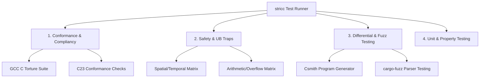

# `stricc` Compiler Test Plan

This document outlines the testing strategy, framework architecture, and execution plans for the `stricc` compiler to ensure absolute safety, C23 standard compliance, and GCC CLI compatibility across thousands of test cases.

---

## 1. Testing Philosophy & Objectives

1. **Safety Verification**: Ensure that *every* form of Undefined Behavior (UB) defined in the specification triggers a compile-time rejection or a deterministic runtime abort.
2. **Correctness & Compliance**: Validate that valid C programs yield identical execution results when compiled with both standard compilers (GCC/Clang) and `stricc`.
3. **Scale (Thousands of Test Cases)**: Leverage automated program generators and industry-standard conformance suites to run thousands of tests.
4. **100% Code Coverage**: Enforce strict statement and branch coverage targets in CI/CD for all compiler passes.

---

## 2. Test Suite Categories



### 2.1 Conformance & Compliance Testing (Differential Execution)
To verify that `stricc` conforms to standard C syntax and semantics:
* **GCC C Torture Test Suite**: Import the GCC test suite (specifically the `gcc.c-torture/execute` subset, containing **over 1,500 test cases**). 
  * These tests check execution logic for math, pointer movements, and structures.
  * *Success Criterion*: Code compiles under `stricc` and produces identical output values/exit codes compared to GCC.
* **C23 Validation Suite**: A custom suite of **150+ tests** validating C23-specific syntax (e.g. `nullptr`, `auto` inference, `constexpr` evaluations).

### 2.2 Safety & Undefined Behavior Traps (Negative Testing)
To verify that `stricc` catches all memory safety errors and UB, we define a **Safety Matrix** of **500+ hand-written and generated test cases** designed to trigger safety violations:

| UB Category | Stack Tests | Heap Tests | Global Tests | Static/Struct Tests |
| :--- | :--- | :--- | :--- | :--- |
| **Spatial Bounds** | Local array bounds | Heap buffer bounds | Global buffer bounds | Struct member offsets |
| **Temporal Safety** | Return stack address | Use-after-free | N/A | Dangling struct pointers |
| **Double Free** | N/A | Double free | N/A | Multiple struct field frees |
| **Uninitialized Read**| Local scalar / ptr | Heap allocations | Global defaults | Uninitialized fields |
| **Arithmetic** | Signed overflow | Division by zero | Float overflow | Conversions / bit-shifts |

* *Success Criterion*: Program is either **rejected at compile-time** (via Value Range Propagation or escape analysis) or **aborts cleanly at runtime** with a DWARF-symbolicated backtrace pointing to the exact crash instruction.

### 2.3 Automated Fuzz & Program Generation (Differential Fuzzing)
To achieve test scales of **10,000+ test cases**, we integrate automated tools:
* **Csmith Integration**: Use `Csmith` (a random C program generator) to output random C programs that are guaranteed to have no undefined behavior.
  * **Test Loop**:
    1. Generate C program using `csmith --no-safe-math --no-pointers`.
    2. Compile with `gcc -O2` and run to get exit code/stdout hash.
    3. Compile with `stricc -O2` and run.
    4. Assert that exit codes and stdout outputs are identical.
  * *Scale*: Run **5,000 randomized Csmith cycles** in nightly CI.
* **yarpgen Integration**: Use `yarpgen` (Yet Another Random Program Generator) to generate UB-free compiler optimization test cases.
* **Frontend Parser Fuzzing**: Use `cargo-fuzz` (libFuzzer) on the `stricc` lexer and parser. Feed millions of mutated inputs to ensure the compiler never panics/crashes on malformed source code.

### 2.4 Unit & Property-Based Testing
* **Rust Unit Tests**: Every module in `lexer`, `parser`, `typechecker`, and `codegen` must have corresponding Unit Tests.
* **Property-Based Testing (`proptest`)**: Generate random abstract syntax trees (ASTs) to verify that formatting and semantic analysis properties hold (e.g., parsing a formatted AST produces the identical AST).

---

## 3. Test Runner Infrastructure (`tests/runner.rs`)

A custom Rust test runner will automate the execution pipeline:

```rust
struct TestCase {
    path: PathBuf,
    expected_result: ExpectedResult, // CompileError, RuntimeAbort, or CleanExit(i32)
    require_backtrace: bool,
}

enum ExpectedResult {
    CompileError(String), // Match sub-string in compile error
    RuntimeAbort(String), // Match DWARF traceback patterns
    CleanExit { exit_code: i32, stdout_hash: String },
}
```

### CLI Flag Testing
The runner will test flag combinations across all conformance files:
```bash
# Verify output files across compilation flags
stricc -c -o test.o test.c
stricc -S -o test.s test.c
stricc -emit-llvm -o test.ll test.c
```

---

## 4. CI/CD & Code Coverage Integration

* **GitHub Actions CI/CD Pipeline**: 
  * A GitHub workflow (`.github/workflows/ci.yml`) is triggered on every `push` and `pull_request` to the repository.
  * **GCC Test Suite Check**: The CI workflow builds the compiler and executes the entire **GCC C Torture Test Suite** (1,500+ execution tests) to guarantee regression-free compliance before any commit is merged.
  * **Test Runner Execution**: Runs all unit, integration, safety matrix, and CLI compatibility checks.
* **Test Coverage Enforcement**:
  * Tools: Use `cargo-llvm-cov` to track Rust compiler coverage.
  * Gate: The build pipeline **fails** if line or branch coverage drops below **100%** on key compiler passes (frontend parser, type checker, LLVM IR emitter).
* **Runtime Support Library Memory Audits**:
  * **LeakSanitizer (LSan) & Valgrind**: The CI/CD pipeline runs the safety trap tests wrapped under LSan/ASan and Valgrind to verify that the runtime support library (`libstricc_rt`) has zero memory leaks, heap corruptions, or race conditions within its shadow table management and version metadata mapping.
