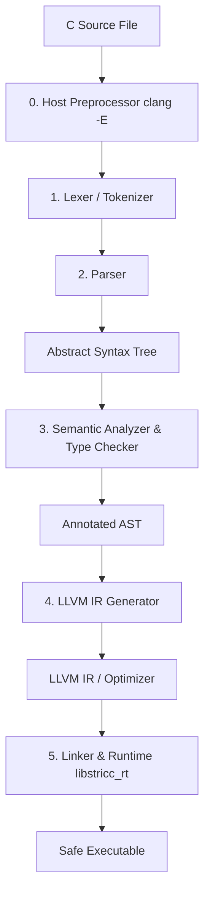

# Compiler Architecture & Pipeline Design

This document details the internal design and pipeline of the `stricc` compiler. If you are a new developer or junior engineer joining the project, this guide will serve as a map of the codebase and help you understand how a C source file is transformed into a safe, runnable binary.

---

## LLVM Basics for Beginners

If you have never worked with compilers or LLVM before, here is a quick primer to help you understand the architecture of `stricc`.

### Is LLVM an Interpreter or a Compiler?
**LLVM is a compiler backend framework**, not an interpreter. 
- An **interpreter** (like the Python or Node.js runtime) reads and executes code line-by-line at runtime.
- A **compiler** (like GCC or `stricc`) translates your human-readable source code into machine code *before* execution, producing a standalone executable file that runs directly on the CPU.

`stricc` uses LLVM to handle the complex parts of compilation (optimizations, machine code generation). Instead of writing machine-specific assembly code by hand, `stricc` translates your C code into a high-level assembly-like language called **LLVM Intermediate Representation (IR)**. We then hand this IR over to LLVM, which optimizes it and translates it into a native CPU binary.

### What Target Architectures does stricc Compile to?
Because `stricc` uses LLVM as its backend, it inherits LLVM's wide architecture support. You can compile your C code to run natively on:
- **x86_64**: Standard 64-bit Intel and AMD processors (commonly found in laptops, desktops, and servers).
- **AArch64 / ARM64**: Modern 64-bit ARM processors (found in Apple Silicon Macs, Raspberry Pi, Android/iOS devices, and modern cloud servers like AWS Graviton).
- **RISC-V**: Open-standard CPU architectures.
- **WebAssembly (Wasm)**: A format for running code at near-native speed inside web browsers.

### Do I Need to Install OS Packages?
Yes, to build the `stricc` compiler binary from source code, your operating system must have the **LLVM 18 development libraries** installed. These packages provide the C++ libraries and configuration tools (`llvm-config`) that our Rust compiler driver links against.

- **macOS**: Install via Homebrew: `brew install llvm@18` (and set target environment variables).
- **Ubuntu/Debian**: Install via apt: `sudo apt-get install llvm-18 llvm-18-dev clang-18`.
- **Alternative (No Setup)**: If you do not want to install these packages on your host OS, you can use the **Docker sandbox container** (`Dockerfile.run`), which packages the compiler, LLVM 18, and all dependencies into a lightweight Linux environment.

---

## The Compiler Pipeline

Like most modern compilers, `stricc` functions as a sequential pipeline. Each stage has a single, focused responsibility. Below is a diagram illustrating the flow:



Here is a step-by-step walkthrough of what happens at each stage:

---

## 0. Preprocessing (`clang -E`)
Before `stricc` sees your C code, the compiler driver delegates preprocessing to the host's C preprocessor (defaulting to Clang). 
- **What it does**: Expands macros (like `#define`), processes conditional compilation directives (like `#ifdef`), and resolves file inclusions (like `#include <stdio.h>`).
- **Why it matters**: `stricc` tracks line markers emitted by the preprocessor (e.g. `# 12 "main.c"`) so that subsequent parsing errors and runtime tracebacks point to the correct line in your original source files.

---

## 1. The Lexer (`lexer.rs`)
The lexer (or tokenizer) is the first frontend stage.
- **Input**: The raw string of preprocessed C source code.
- **Output**: A sequential stream of `Token` structures representing the vocabulary of the program (keywords, numbers, punctuation, identifiers).
- **Analogy**: If your C code is a paragraph, the lexer splits it into individual words and punctuation marks, discarding spaces and comments.

For example:
```c
int x = 42;
```
Is converted into the token stream: `[Keyword(Int), Identifier("x"), Equal, Number(42), Semicolon]`.

---

## 2. The Parser (`parser.rs`)
The parser is hand-written as a **recursive descent parser**.
- **Input**: The token stream from the Lexer.
- **Output**: An **Abstract Syntax Tree (AST)**, which is a nested, hierarchical structure representing the grammatical logic of your program.

### Visualizing the AST
For the statement `x = y + 2;`, the parser constructs a tree layout:

```text
       AssignmentExpr (=)
       /                \
Identifier (x)        BinaryExpr (+)
                      /            \
               Identifier (y)     Literal (2)
```

### Key Parsing Features for Juniors:
1. **Handwritten vs Parser Generator**: Unlike compilers that use tools like Yacc or Bison, `stricc`'s parser is hand-coded. This makes it easier to extend with custom dialects and allows for highly detailed compile-time diagnostic errors (using caret indicators pointing to the exact character span).
2. **Error Recovery**: If the parser encounters a syntax error (like a missing semicolon), it does not immediately crash. It records the error, discards tokens until it finds a synchronization boundary (such as a semicolon `;` or closing brace `}`), and resumes parsing. This allows the compiler to report multiple errors in a single run.

---

## 3. Semantic Analyzer & Type Checker (`typechecker.rs`)
This is the compiler's "brain" and the first line of defense against bugs.
- **Input**: The AST.
- **Output**: An **Annotated AST** where every node is verified for type correctness and annotated with semantic properties.
- **What it does**:
  - **Type Checking**: Ensures you don't perform invalid operations (like adding a pointer to a struct or assigning a floating-point number to a function pointer).
  - **Definite Assignment Analysis**: Guarantees that local variables are initialized/written to before they are read.
  - **Definite Return Analysis**: Verifies that every control flow path in a value-returning function ends with a `return` statement.
  - **Stack Escape Analysis**: Tracks pointer lifetimes and statically rejects code that returns a pointer to a stack-allocated variable that would become dangling when the function exits.
  - **Value Range Propagation (VRP)**: Computes the potential range of index variables at compile-time. If it proves an array access is always within bounds, it marks the AST node to bypass runtime checking, saving CPU cycles.

---

## 4. LLVM IR Generator (`codegen.rs`)
This stage translates the annotated AST into **LLVM Intermediate Representation (IR)** using the `inkwell` library.
- **Input**: The Annotated AST.
- **Output**: Optimized LLVM assembly bitcode (`.ll` or `.bc`).
- **Safety Instrumentation**:
  - Emits LLVM checks before divisions to trap division-by-zero.
  - Lowers signed arithmetic operations to LLVM intrinsics with overflow flags (like `@llvm.sadd.with.overflow`).
  - Emits call instructions to the `libstricc_rt` runtime to perform spatial bounds checks and temporal key checks on pointer dereferences.

---

## 5. Linker (`driver.rs`)
The compiler driver invokes `clang` downstream to act as the linker.
- **What it does**: Takes the machine code object file generated by LLVM and links it with `libstricc_rt.a` (the `stricc` safe runtime support library) and the standard system libraries.
- **Why it matters**: This produces the final standalone executable. Without linking `libstricc_rt.a`, safety checks and symbolicated backtrace routines will fail to resolve.
