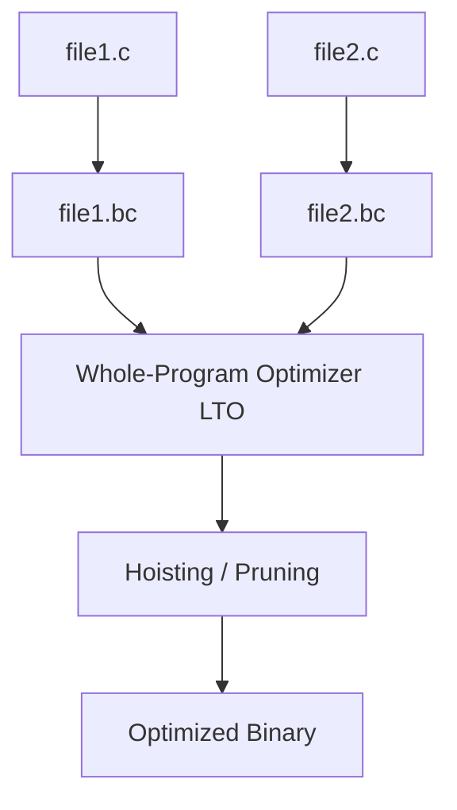

# Performance & Optimization Specification

Adding memory safety checks to pointer operations inevitably introduces execution overhead. This document describes the overhead profile of the `stricc` compiler and details the static optimizations implemented to mitigate performance penalties.

---

## 1. The Cost of Safety Checks

By default, every pointer dereference (`*p`) and memory operation generates safety checks:
1. **Spatial Check**: Compares pointer address against `base` and `base + size`.
2. **Temporal Check**: Fetches the active version key of the memory allocation from the allocation map and verifies it matches the pointer's key.

Without compiler optimization, these checks add multiple branch and memory-read instructions per dereference. This can degrade performance (sometimes a 2x-3x slowdown on pointer-heavy or memory-intensive loops).

---

## 2. Value Range Propagation (VRP)

To achieve near-native execution speeds, the `stricc` typechecker implements **Value Range Propagation (VRP)**.

### How it works:
VRP is a static analysis pass that computes the possible range of values integer variables can take at any point in the program.

### Static Check Elimination:
If VRP can mathematically prove that a pointer access is guaranteed to be within its allocated boundary, the compiler **suppresses safety check generation** in the output LLVM IR.

### Example:
```c
void process_array() {
    int arr[10];
    // The compiler knows 'i' goes from 0 to 9
    for (int i = 0; i < 10; i++) {
        arr[i] = i; // VRP proves 0 <= i < 10. Bounds check is omitted!
    }
}
```
In this example, the loop runs at **100% native hardware speed** with zero safety check overhead.

---

## 3. Link-Time Optimization (LTO)

When building programs with multiple source files, static compiler analysis is normally limited to one file at a time. This prevents the compiler from optimizing checks across function calls.

To solve this, `stricc` compiles all code to LLVM bitcode and applies **Link-Time Optimization (LTO) by default**:



LTO enables two critical safety optimizations:

### A. Bounds Check Hoisting
If a pointer is checked inside a loop but the pointer address doesn't change, the LTO optimizer lifts the bounds check **outside** the loop:

```text
// Before Optimization:
loop 1000 times:
    check_bounds(p) // Evaluated 1000 times
    read *p

// After LTO Hoisting:
check_bounds(p)    // Evaluated ONCE
loop 1000 times:
    read *p
```

### B. Redundant Check Pruning
If a function `process_data(int *p)` checks the bounds of `p`, and then passes `p` to `helper_func(p)`, the LTO interprocedural analysis proves that the bounds of `p` have already been verified. It deletes all bounds checking code inside `helper_func(p)`.

---

## 4. Tips for Maximizing Performance

If you are a developer looking to get the best speed from `stricc`, apply these practices:
- **Enable high optimization flags**: Use `-O2` or `-O3` to trigger LLVM's advanced loop optimization passes.
- **Use simple loop boundaries**: VRP works best when loop bounds are constants or simple induction variables. Avoid complex arithmetic on loop index variables.
- **Minimize pointer variables in memory**: Storing pointers in registers is far faster than storing them inside structures, as structure pointers require shadow memory map lookups.
